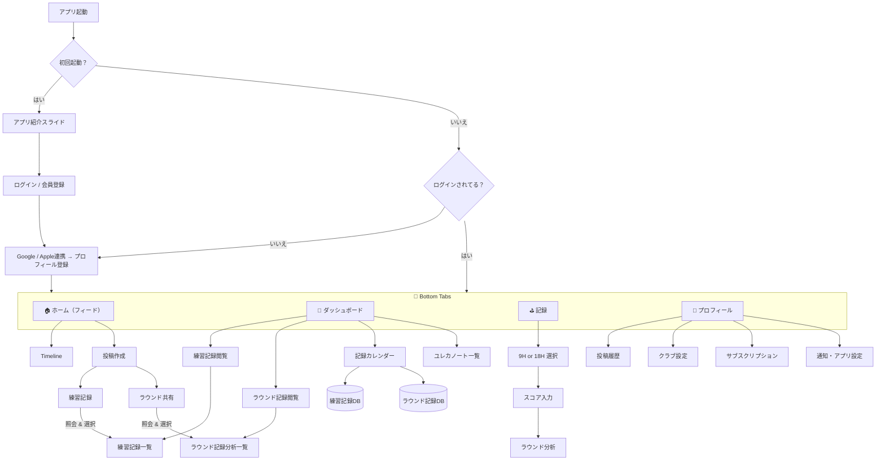

# アプリナビゲーション構造

このドキュメントでは、アプリケーションのナビゲーション構造を説明します。

## 全体フロー

以下のフローチャートは、アプリケーションの全体的なナビゲーション構造を示しています：

## 主要なナビゲーションフロー

### 1. オンボーディングフロー

- 初回起動時のみ表示
- アプリ紹介スライド
- ログイン/会員登録
- Google/Apple 連携
- プロフィール登録

### 2. メインアプリ（Bottom Tabs）

- 🏠 ホーム（フィード）
- 📅 ダッシュボード
- ⛳ 記録
- 👤 プロフィール

### 3. ホームタブ

- Timeline
- 投稿作成
  - 練習記録
  - ラウンド共有

### 4. ダッシュボードタブ

- 練習記録閲覧
- ラウンド記録閲覧
- 記録カレンダー
- ユレカノート一覧

### 5. 記録タブ

- 9H or 18H 選択
- スコア入力
- ラウンド分析

### 6. プロフィールタブ

- 投稿履歴
- クラブ設定
- サブスクリプション
- 通知・アプリ設定
